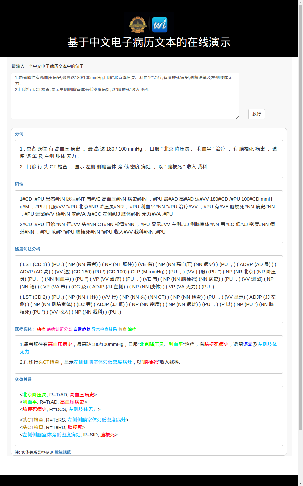

# RESOURCES

Bin He, Bin Dong, Yi Guan, Jinfeng Yang, Zhipeng Jiang, Qiubin Yu, Jianyi Cheng, and Chunyan Qu. 2017. [Building a Comprehensive Syntactic and Semantic Corpus of Chinese Clinical Texts](paper.pdf). Journal of Biomedical Informatics 69: 203–17. doi:10.1016/j.jbi.2017.04.006.

**Contact:** [Bin He](https://binherunning.github.io/)

## Resouces of Clinical Texts within the Chinese Electronic Medical Record ##

- WORD SEGMENTATION, POS, PARSING
- ENTITY, ASSERTION, RELATION
- STATEMENT OF THE ETHICS

## Demo ##
- word segmentation, POS tagging, shallow parsing, named entity recognition, relation extraction
- [Go to the demo](http://47.100.64.126:8018/cemr/) 

